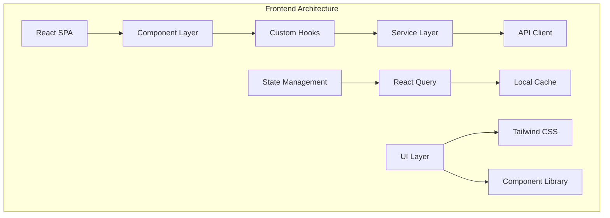

# Maria Faz System Architecture Validation Report

## Executive Summary

This document provides a comprehensive analysis of the current Maria Faz system architecture, validates it against the defined requirements, identifies architectural gaps, and provides recommendations for achieving a robust offline-first property management system.

## Current System Architecture Analysis

### 1. Frontend Architecture

**Technology Stack:**
- React 18 with TypeScript
- Vite for build tooling and development
- Tailwind CSS for styling
- React Query (TanStack Query) for state management
- React Router for navigation
- i18next for internationalization

**Architecture Pattern:**
- Single Page Application (SPA)
- Component-based architecture
- Custom hooks for business logic
- Service layer pattern for API communication



### 2. Backend Architecture

**Technology Stack:**
- Express.js with TypeScript
- PostgreSQL database
- Drizzle ORM
- AI Services Integration (Gemini, OpenRouter, RolmOCR)
- PDF processing with pdf-parse
- File upload handling with Multer

**Architecture Pattern:**
- RESTful API design
- Service layer architecture
- Database access layer with ORM
- AI adapter pattern for multiple AI providers


### 3. Current Data Flow


## Requirements Validation

### ✅ Current Compliance

1. **AI Integration**: Successfully implemented with multiple AI providers
2. **PDF Processing**: Robust PDF import pipeline with OCR capabilities
3. **Data Extraction**: Intelligent extraction of reservation data
4. **Multi-language Support**: i18next implementation
5. **Modern Tech Stack**: React, TypeScript, PostgreSQL

### ❌ Critical Gaps Identified

1. **NO External API Dependencies**: System currently requires internet for AI services
2. **100% Offline Operation**: No offline data persistence layer
3. **Local-First Architecture**: Missing local storage and sync mechanisms
4. **Service Worker**: Basic implementation, lacks offline functionality

## Architectural Gaps Analysis

### 1. Offline Storage Layer (CRITICAL GAP)

**Current State:** No local data persistence
**Required:** Offline-first data architecture


### 2. PDF Import Architecture (NEEDS ENHANCEMENT)

**Current State:** Server-dependent AI processing
**Required:** Client-side PDF processing


### 3. Local AI Integration (MISSING)

**Current State:** Cloud-dependent AI services
**Required:** Local AI processing capabilities

## Recommended Architecture Improvements

### 1. Offline-First Data Architecture


**Implementation Strategy:**
```typescript
// Offline Storage Layer
interface OfflineStorageManager {
  // Local data operations
  storeReservation(data: ReservationData): Promise<void>;
  getReservations(): Promise<ReservationData[]>;
  
  // Sync operations  
  queueForSync(operation: SyncOperation): Promise<void>;
  syncWhenOnline(): Promise<void>;
  
  // Conflict resolution
  resolveConflicts(conflicts: DataConflict[]): Promise<void>;
}
```

### 2. Enhanced PDF Processing Pipeline


**Implementation Strategy:**
```typescript
interface OfflinePDFProcessor {
  // Client-side processing
  extractText(pdfFile: File): Promise<string>;
  parseReservationData(text: string): Promise<ReservationData>;
  
  // Pattern matching
  matchTemplates(text: string): Promise<TemplateMatch[]>;
  extractFields(text: string, template: Template): Promise<FieldData>;
  
  // Fallback to AI when online
  enhanceWithAI(data: ReservationData): Promise<ReservationData>;
}
```

### 3. Local AI Integration Options


### 4. Progressive Web App (PWA) Enhancement


## Implementation Roadmap

### Phase 1: Offline Foundation (4-6 weeks)
1. **Service Worker Enhancement**
   - Implement robust caching strategies
   - Add background sync capabilities
   - Create offline fallback pages

2. **Local Storage Layer**
   - IndexedDB integration with Dexie.js
   - Local data models and schemas
   - Basic CRUD operations offline

3. **Sync Engine**
   - Queue system for offline operations
   - Basic sync when online
   - Conflict detection

### Phase 2: Enhanced PDF Processing (3-4 weeks)
1. **Client-Side PDF Parser**
   - PDF.js integration
   - Text extraction algorithms
   - Template matching system

2. **Pattern Recognition**
   - Regex-based field extraction
   - Template library for common formats
   - Validation and error handling

3. **Local OCR (Optional)**
   - Tesseract.js integration
   - Image processing capabilities
   - Quality optimization

### Phase 3: AI Integration (2-3 weeks)
1. **Hybrid AI Approach**
   - Local processing first
   - AI enhancement when available
   - Graceful degradation

2. **WebAssembly Models (Advanced)**
   - Small ML models for field detection
   - Text classification
   - Data validation

### Phase 4: PWA Completion (2-3 weeks)
1. **Full Offline Capability**
   - Complete app functionality offline
   - Data persistence and sync
   - User experience optimization

2. **Installation & Distribution**
   - App manifest optimization
   - Installation prompts
   - Update mechanisms

## Performance Considerations

### Local Storage Optimization
```typescript
interface StorageStrategy {
  // Efficient data structures
  useIndexedDB(): boolean;
  compressData(): boolean;
  
  // Memory management
  cleanupOldData(): Promise<void>;
  optimizeQueries(): Promise<void>;
  
  // Performance monitoring
  measurePerformance(): StorageMetrics;
}
```

### PDF Processing Performance
```typescript
interface PDFPerformance {
  // Chunked processing
  processInChunks(pdf: File): Promise<ProcessedChunk[]>;
  
  // Web Workers
  useWebWorker(): boolean;
  
  // Caching
  cacheProcessedResults(): boolean;
  
  // Progress tracking
  onProgress(callback: (progress: number) => void): void;
}
```

## Security Considerations

### 1. Local Data Security
- Encrypt sensitive data in IndexedDB
- Secure key management for local encryption
- User consent for local storage

### 2. File Processing Security
- Validate PDF files before processing
- Sanitize extracted data
- Prevent XSS in displayed content

### 3. Sync Security
- Encrypted sync operations
- Authentication for sync endpoints
- Data integrity verification

## Deployment Architecture

### Current Deployment (Vercel)


### Recommended Architecture


## Conclusion

The Maria Faz system has a solid foundation with modern technologies and good architectural patterns. However, to meet the offline-first requirements, significant enhancements are needed:

### Critical Actions Required:
1. **Implement offline-first data architecture** with IndexedDB and sync capabilities
2. **Enhance PDF processing** to work client-side without external dependencies
3. **Add robust Service Worker** with caching and background sync
4. **Create hybrid AI approach** that works offline with online enhancement

### Success Metrics:
- ✅ 100% offline functionality for core features
- ✅ PDF processing without internet connection
- ✅ Data persistence across sessions
- ✅ Seamless online/offline transitions
- ✅ Fast load times and responsive UI

The recommended phased approach will transform Maria Faz into a truly offline-first property management system while maintaining its current strengths and AI capabilities.