# Mapa da Aplicação Maria Faz

## Estrutura de Páginas da Aplicação

```mermaid
graph TD
    A[🏠 Início/Dashboard] --> B[📊 Dashboard Completo]
    
    A --> C[📅 Reservas]
    C --> C1[📋 Lista de Reservas]
    C --> C2[➕ Nova Reserva]
    C --> C3[👁️ Detalhes da Reserva]
    C --> C4[✏️ Editar Reserva]
    
    A --> D[🏢 Imóveis]
    D --> D1[📋 Lista de Imóveis]
    D --> D2[👁️ Detalhes do Imóvel]
    D --> D3[✏️ Editar Imóvel]
    D --> D4[📈 Estatísticas do Imóvel]
    
    A --> E[👥 Proprietários]
    E --> E1[📋 Lista de Proprietários]
    E --> E2[👁️ Detalhes do Proprietário]
    E --> E3[✏️ Editar Proprietário]
    
    A --> F[💰 Finanças]
    F --> F1[💳 Despesas]
    F --> F2[💰 Recebimentos]
    F --> F3[📄 Orçamentos]
    F3 --> F3A[➕ Novo Orçamento]
    F3 --> F3B[👁️ Detalhes do Orçamento]
    F3 --> F3C[✏️ Editar Orçamento]
    F --> F4[📑 Documentos Financeiros]
    F4 --> F4A[➕ Novo Documento]
    F4 --> F4B[👁️ Detalhes do Documento]
    F4 --> F4C[✏️ Editar Documento]
    
    A --> G[📊 Relatórios]
    G --> G1[📈 Relatórios Gerais]
    G --> G2[👤 Relatórios de Proprietário]
    G --> G3[🧹 Relatórios de Limpeza]
    
    A --> H[🔧 Ferramentas]
    H --> H1[📄 Scanner de Documentos]
    H --> H2[🤖 Maria IA Assistente]
    
    A --> I[🧹 Operações de Limpeza]
    I --> I1[👥 Equipas de Limpeza]
    I --> I2[📅 Agendamentos de Limpeza]
    I --> I3[📊 Relatórios de Limpeza]
    
    A --> J[🔧 Manutenção]
    J --> J1[⏳ Manutenção Pendente]
    J --> J2[➕ Solicitar Manutenção]
    
    A --> K[⚙️ Configurações]
    K --> K1[🔔 Notificações]
    K --> K2[🌍 Idioma]
    K --> K3[🔗 Integrações]
    K --> K4[🤖 Configuração de IA]

    classDef primary fill:#e1f5fe,stroke:#01579b,stroke-width:2px
    classDef secondary fill:#f3e5f5,stroke:#4a148c,stroke-width:2px
    classDef accent fill:#e8f5e8,stroke:#1b5e20,stroke-width:2px
    
    class A,C,D,E,F,G primary
    class H,I,J secondary
    class K accent
```

## Menu de Navegação Simplificado

### 🖥️ Desktop (Sidebar)
1. **Principal**
   - Início
   - Reservas
   - Imóveis
   - Proprietários
   - Finanças
   - Relatórios

2. **Ferramentas**
   - Scanner
   - Maria IA
   - Configurações

### 📱 Mobile (Bottom Nav)
1. Início
2. Reservas
3. Imóveis
4. Finanças
5. Config

## 🧹 Acesso às Equipas de Limpeza

As equipas de limpeza podem ser acedidas através de:

1. **Menu Principal** → **Relatórios** → **Relatórios de Limpeza**
2. **URL Direta**: `/equipas-limpeza` ou `/cleaning-teams`
3. **URL para Relatórios**: `/relatorios-limpeza` ou `/cleaning-reports`

## 🔒 Estado de Segurança

- ✅ Dark mode removido (reduz superfície de ataque)
- ✅ Dados demo bloqueados permanentemente
- ✅ Gemini 2.5 Flash Preview configurado
- ✅ Todas as traduções implementadas
- ✅ Apenas dados reais da base de dados
- ✅ Rate limiting implementado
- ✅ Validação de inputs
- ✅ PostgreSQL com sanitização

## 📦 Preparação para Deploy

A aplicação está pronta para deploy com:
- Configuração de produção otimizada
- Base de dados PostgreSQL configurada
- Variáveis de ambiente seguras
- Assets otimizados