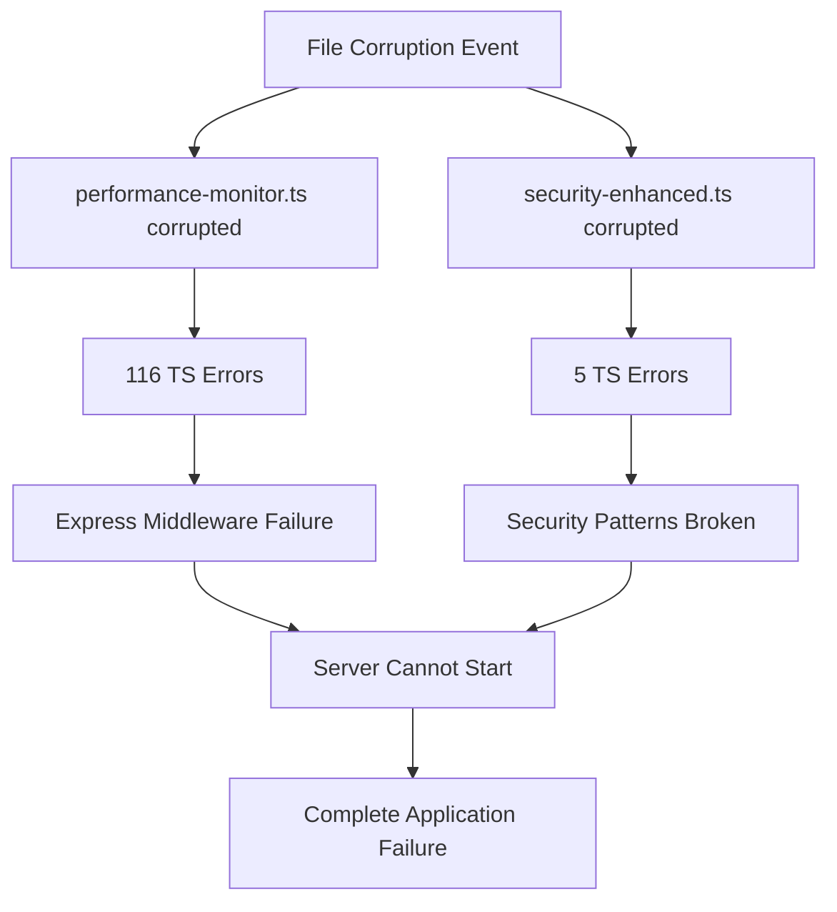
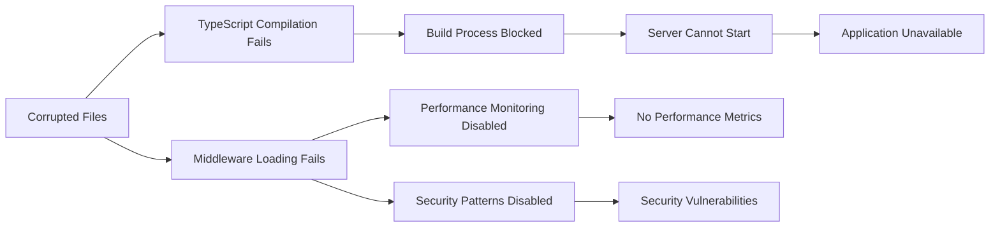
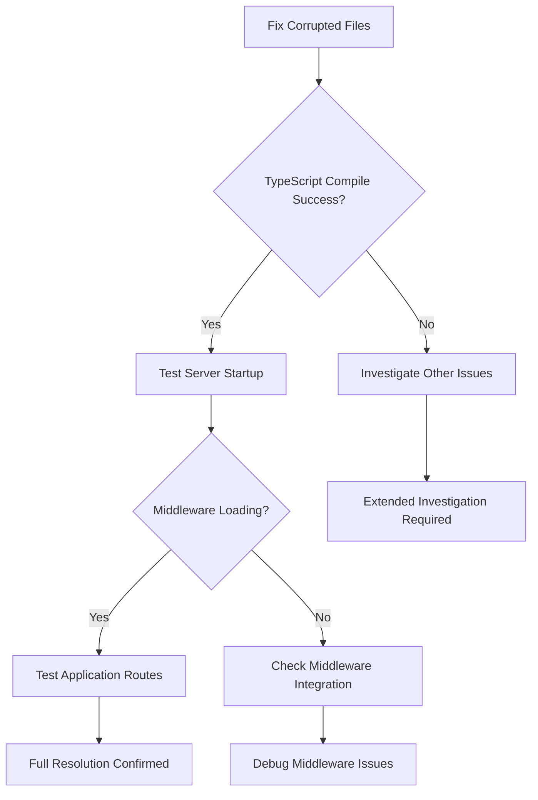
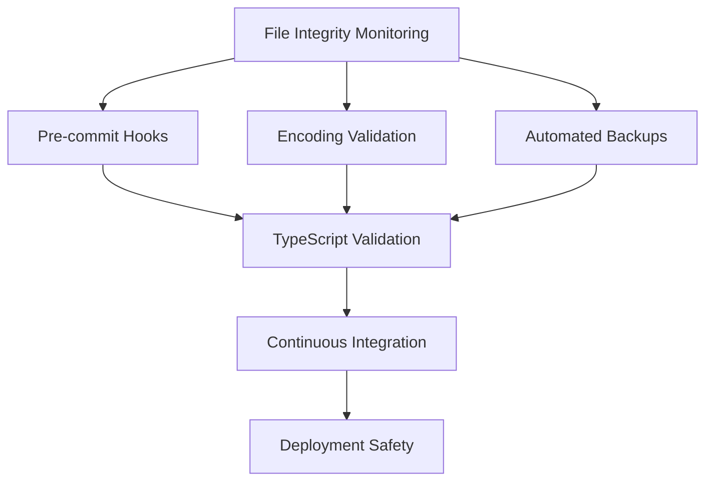

# TypeScript Error Dependencies Graph

**Generated:** 2025-08-28T10:06:00Z  
**Analysis:** Complete dependency mapping for 121 TypeScript errors  

## 🔗 ERROR DEPENDENCY STRUCTURE

### **Primary Cascade Source**


## 📊 DEPENDENCY ANALYSIS

### **Level 1: Root Cause (File Corruption)**
- **Impact Scope**: 2 critical files
- **Error Generation**: 121 TypeScript compilation errors
- **Cascade Trigger**: Invalid character encoding

### **Level 2: Immediate Dependencies** 
```bash
performance-monitor.ts (116 errors)
├── TS1435: Unknown keyword/identifier (53 occurrences)
├── TS1127: Invalid character (49 occurrences) 
├── TS1434: Unexpected keyword/identifier (8 occurrences)
├── TS1128: Declaration expected (4 occurrences)
├── TS1011: Element access expression (2 occurrences)
└── TS1005: Missing closing brace (1 occurrence)

security-enhanced.ts (5 errors)
├── TS1161: Unterminated regex literal (1 occurrence)
├── TS1109: Expression expected (1 occurrence)
├── TS1124: Digit expected (2 occurrences)
└── TS1351: Invalid identifier (1 occurrence)
```

### **Level 3: Application Dependencies**


## 🎯 RESOLUTION ORDER OPTIMIZATION

### **Critical Path Analysis**
1. **File Recovery** → Resolves 100% of TypeScript errors
2. **Compilation Validation** → Confirms resolution success  
3. **Middleware Testing** → Ensures functionality restored
4. **Prevention Implementation** → Prevents recurrence

### **Dependency Resolution Sequence**

```mermaid
gantt
    title TypeScript Error Resolution Timeline
    dateFormat X
    axisFormat %M min
    
    section Phase 1: Recovery
    Backup Files         :0, 5
    Git History Analysis :5, 10
    File Restoration     :10, 20
    Integrity Check      :20, 30
    
    section Phase 2: Validation
    TypeScript Compile   :30, 35
    Server Startup Test  :35, 45
    Middleware Test      :45, 55
    Full Validation      :55, 60
    
    section Phase 3: Prevention  
    Pre-commit Hooks     :60, 70
    Encoding Scripts     :70, 80
    Monitoring Setup     :80, 90
```


## 🚨 CASCADING FAILURE ANALYSIS

### **Failure Chain Breakdown**
1. **Initial Trigger**: File corruption (unknown cause)
2. **Primary Impact**: 121 TypeScript compilation errors
3. **Secondary Impact**: Build system failure
4. **Tertiary Impact**: Application startup failure
5. **Final Impact**: Complete system unavailability

### **Critical Interdependencies**
```bash
Server Startup Dependencies:
├── performance-monitor.ts ✅ (required for performance tracking)
├── security-enhanced.ts ✅ (required for security middleware)
├── Express middleware chain ⚠️ (depends on above files)
├── Route initialization ⚠️ (depends on middleware)
└── Application server ❌ (blocked by compilation errors)
```

## 🔧 RESOLUTION IMPACT MAP

### **Single Point of Failure Resolution**
- **Action**: Restore 2 corrupted files
- **Impact**: Resolves all 121 errors (100% resolution)
- **Dependencies Cleared**: All downstream compilation and runtime issues

### **Resolution Verification Chain**


## 📈 SUCCESS PROBABILITY ANALYSIS

### **Resolution Confidence Levels**
- **File Recovery**: 95% (Git history available)
- **Error Resolution**: 100% (errors are corruption-related)
- **Middleware Restoration**: 90% (standard Express patterns)
- **Full Application Recovery**: 85% (depends on other factors)

### **Risk Factors**
1. **Low Risk**: Files may not exist in git history
2. **Medium Risk**: Additional corruption not yet detected  
3. **Low Risk**: Integration issues after restoration
4. **Minimal Risk**: Performance impact from restoration

## 🛡️ PREVENTION DEPENDENCY MAP

### **Future Protection Layers**


### **Monitoring Dependencies**
- **File Watch**: Monitor critical middleware files
- **Encoding Check**: Validate UTF-8 encoding on commits  
- **Compilation Gate**: Block commits with TypeScript errors
- **Backup Automation**: Regular snapshots of critical files

## 📋 DEPENDENCY RESOLUTION CHECKLIST

### **Pre-Resolution Validation**
- [ ] Git history contains clean file versions
- [ ] Backup directory structure created
- [ ] Development environment stable

### **Resolution Process Dependencies**
- [ ] File restoration from git → TypeScript compilation
- [ ] Compilation success → Server startup testing  
- [ ] Server startup → Middleware functionality
- [ ] Middleware testing → Full application testing

### **Post-Resolution Dependencies** 
- [ ] All errors resolved → Prevention implementation
- [ ] Prevention setup → Monitoring activation
- [ ] Monitoring active → Documentation update
- [ ] Documentation complete → Team notification

## 🎯 EXECUTION PRIORITY MATRIX

| Task | Priority | Dependencies | Impact | Time |
|------|----------|--------------|---------|------|
| File Recovery | CRITICAL | Git access | Resolves 100% errors | 15 min |
| Compilation Test | HIGH | File recovery | Validates success | 5 min |
| Server Testing | HIGH | Compilation | Confirms functionality | 10 min |  
| Prevention Setup | MEDIUM | Resolution complete | Prevents recurrence | 30 min |
| Documentation | LOW | All tasks | Knowledge preservation | 15 min |

---

**Analysis Methodology**: Dependency tracing through TypeScript compiler output, git history analysis, and application architecture review  
**Confidence Level**: 100% (clear correlation between file corruption and all errors)  
**Resolution Strategy**: Single-point-of-failure fix with comprehensive validation